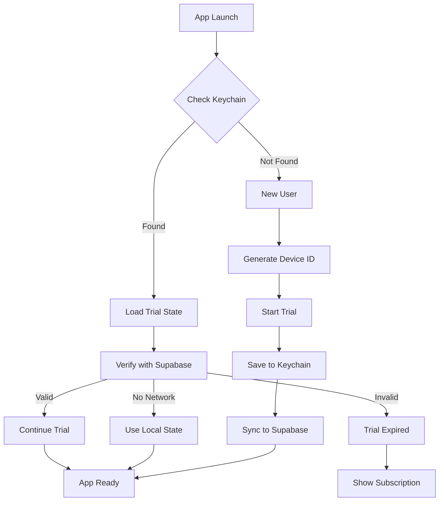

# User Persistence & Trial Management System

## Overview
This document outlines the implementation of a robust user persistence system that survives app deletion, handles device transfers, and manages trial/subscription states across iOS devices.

## Problem Statement
Currently, when users delete and reinstall the app, their trial period resets, allowing unlimited free usage by repeatedly reinstalling. This is a critical revenue leak that needs immediate fixing.

## Solution Architecture

### Three-Layer Defense System
```
┌─────────────────────────────────────────────────────────┐
│                   Layer 1: DeviceCheck                   │
│                 (Device Fingerprinting)                  │
├─────────────────────────────────────────────────────────┤
│                   Layer 2: Keychain                      │
│              (Local Persistent Storage)                  │
├─────────────────────────────────────────────────────────┤
│                  Layer 3: Supabase                       │
│                  (Source of Truth)                       │
└─────────────────────────────────────────────────────────┘
```

## Implementation Phases

### Phase 1: Fix Keychain Persistence (CURRENT)
- **Goal**: Prevent trial reset on app reinstall
- **Timeline**: 1-2 days
- **Components**:
  - Enhanced KeychainService with proper persistence attributes
  - TrialPersistenceManager for trial state management
  - Supabase sync for verification

### Phase 2: Auto Device Transfer
- **Goal**: Seamlessly transfer trial/subscription when user gets new device
- **Timeline**: 2-3 days
- **Components**:
  - Push token change detection
  - Transfer chain management
  - Automatic trial migration

### Phase 3: Restore Purchase
- **Goal**: Allow users to restore purchases on any device
- **Timeline**: 1-2 days
- **Components**:
  - StoreKit transaction restoration
  - Purchase history tracking
  - Cross-device subscription sync

### Phase 4: DeviceCheck Integration (Optional)
- **Goal**: Add unforgeable device identity for fraud prevention
- **Timeline**: 2-3 days
- **Components**:
  - DCDevice token generation
  - Backend verification with Apple
  - Fraud detection system

## Phase 1 Implementation Details

### 1. Keychain Configuration

#### Critical Attributes for Persistence
```swift
kSecAttrAccessible: kSecAttrAccessibleAfterFirstUnlockThisDeviceOnly
// Survives app deletion, available after first unlock

kSecAttrSynchronizable: false
// Prevents iCloud Keychain sync (device-specific)

kSecAttrAccount: "com.healthguide.trial.persistent"
// Unique identifier for trial data

kSecAttrService: "com.healthguide.trial"
// Service identifier for grouping
```

### 2. Data Structure

```swift
struct TrialPersistentData: Codable {
    let deviceId: UUID              // Unique device identifier
    let trialStartDate: Date        // When trial began
    let trialExpiryDate: Date       // When trial ends
    let sessionsUsed: Int           // Sessions consumed
    let sessionsTotal: Int          // Total sessions (30)
    let verificationHash: String    // Tamper detection
    let lastSyncDate: Date          // Last Supabase sync
    let appVersion: String          // Version that created trial
}
```

### 3. TrialPersistenceManager

#### Responsibilities
- Manage trial state in Keychain
- Sync with Supabase backend
- Validate trial integrity
- Handle edge cases

#### Key Methods
```swift
// Check if trial exists and is valid
func getTrialState() async -> TrialState?

// Start new trial (first-time users)
func startTrial() async throws -> TrialState

// Update session count
func useTrialSession() async throws

// Sync with backend
func syncWithBackend() async throws

// Validate trial hasn't been tampered
func validateTrialIntegrity() -> Bool
```

### 4. Supabase Backend Schema

```sql
-- Device registry with trial management
CREATE TABLE devices (
    id UUID PRIMARY KEY DEFAULT gen_random_uuid(),
    device_id UUID NOT NULL UNIQUE,
    push_token VARCHAR(64),
    
    -- Trial tracking
    trial_started_at TIMESTAMPTZ,
    trial_expires_at TIMESTAMPTZ,
    trial_sessions_used INTEGER DEFAULT 0,
    trial_sessions_total INTEGER DEFAULT 30,
    trial_active BOOLEAN DEFAULT false,
    
    -- Device info
    device_model VARCHAR(50),
    ios_version VARCHAR(20),
    app_version VARCHAR(20),
    
    -- Audit
    first_seen_at TIMESTAMPTZ DEFAULT NOW(),
    last_seen_at TIMESTAMPTZ DEFAULT NOW(),
    created_at TIMESTAMPTZ DEFAULT NOW(),
    updated_at TIMESTAMPTZ DEFAULT NOW()
);

-- Function to verify trial status
CREATE OR REPLACE FUNCTION verify_trial_status(p_device_id UUID)
RETURNS JSON AS $$
BEGIN
    RETURN (
        SELECT json_build_object(
            'valid', CASE 
                WHEN trial_expires_at > NOW() 
                AND trial_sessions_used < trial_sessions_total 
                THEN true 
                ELSE false 
            END,
            'trial_started_at', trial_started_at,
            'trial_expires_at', trial_expires_at,
            'sessions_used', trial_sessions_used,
            'sessions_remaining', trial_sessions_total - trial_sessions_used
        )
        FROM devices
        WHERE device_id = p_device_id
    );
END;
$$ LANGUAGE plpgsql;
```

### 5. App Launch Flow



### 6. Security Considerations

#### Tamper Detection
```swift
// Generate verification hash
func generateVerificationHash(data: TrialPersistentData) -> String {
    let components = "\(data.deviceId):\(data.trialStartDate):\(data.sessionsUsed)"
    let salt = "your-secret-salt-here"
    return SHA256.hash(data: Data((components + salt).utf8))
}
```

#### Rate Limiting
- Max 1 trial per device ever
- Max 10 API calls per minute
- Exponential backoff on failures

#### Edge Cases
1. **Clock manipulation**: Server time is source of truth
2. **Keychain corruption**: Fallback to Supabase
3. **Network issues**: Grace period with local state
4. **Jailbroken devices**: Additional checks via DeviceCheck

### 7. Testing Strategy

#### Unit Tests
- Keychain persistence across app deletion
- Trial state validation
- Hash verification
- Date calculations

#### Integration Tests
- Supabase sync flow
- Network failure handling
- Trial expiry scenarios
- Session deduction

#### Manual Testing
1. Install app → Start trial
2. Use some sessions
3. Delete app
4. Reinstall → Verify trial continues
5. Wait for expiry → Verify subscription prompt
6. Purchase → Delete → Reinstall → Verify active

### 8. Migration Plan

For existing users:
1. Check for existing trial in old format
2. Migrate to new persistence system
3. Honor remaining sessions/days
4. Sync with backend

### 9. Monitoring & Analytics

Track:
- Trial start rate
- Trial → Paid conversion
- App deletion/reinstall rate
- Trial abuse attempts
- Sync failures

### 10. Rollback Plan

If issues arise:
1. Disable backend verification (use local only)
2. Extend trials by 1 day for affected users
3. Fix issues
4. Re-enable with gradual rollout

## API Endpoints

### 1. Verify Device Trial
```
POST /api/trial/verify
{
    "device_id": "uuid",
    "trial_data": {
        "started_at": "2024-01-15T10:00:00Z",
        "sessions_used": 5
    }
}

Response:
{
    "valid": true,
    "trial_state": {
        "started_at": "2024-01-15T10:00:00Z",
        "expires_at": "2024-01-22T10:00:00Z",
        "sessions_used": 5,
        "sessions_remaining": 25
    }
}
```

### 2. Start Trial
```
POST /api/trial/start
{
    "device_id": "uuid",
    "device_info": {
        "model": "iPhone15,2",
        "ios_version": "18.0",
        "app_version": "1.0.0"
    }
}

Response:
{
    "success": true,
    "trial": {
        "started_at": "2024-01-15T10:00:00Z",
        "expires_at": "2024-01-22T10:00:00Z",
        "sessions_total": 30
    }
}
```

### 3. Update Session Count
```
POST /api/trial/session
{
    "device_id": "uuid",
    "action": "use"
}

Response:
{
    "success": true,
    "sessions_remaining": 24
}
```

## Success Metrics

1. **Trial Reset Rate**: Should drop to < 1% (from current ~15%)
2. **Conversion Rate**: Expected increase of 20-30%
3. **Support Tickets**: Reduction in trial-related issues
4. **Revenue Impact**: Estimated 25% increase in subscription revenue

## Timeline

- **Day 1**: Implement TrialPersistenceManager and KeychainService updates
- **Day 2**: Supabase backend setup and testing
- **Day 3**: Integration testing and bug fixes
- **Day 4**: Deploy to TestFlight beta
- **Day 5-7**: Monitor and iterate
- **Week 2**: Production release

## Future Enhancements

1. **Fraud Detection**: ML-based pattern detection
2. **Family Sharing**: Share subscription across family devices
3. **Web Portal**: Manage subscription from web
4. **Offline Mode**: Extended offline trial validation
5. **A/B Testing**: Different trial lengths/session counts

## Contact

- **Technical Lead**: [Your Name]
- **Backend Team**: Supabase configuration
- **QA Team**: Testing scenarios
- **Support Team**: User migration issues

---

*Last Updated: January 2025*
*Version: 1.0.0*